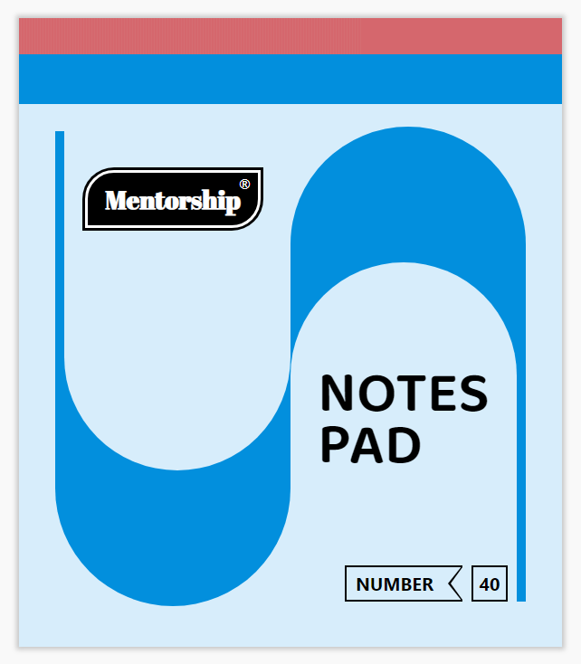
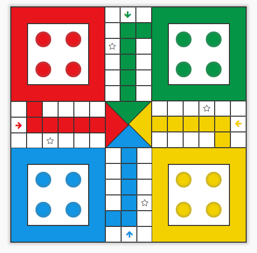

# HTML and CSS Creative Design 

This project contains the different type of web page, layout, shape design using HTML& CSS.

## Design Added 
 
### [Notepad Cover Design Using HTML & CSS](https://youtu.be/8872uN6NK1Q)

This  Notepad cover design tutorial will help you all to design the different types of layout, shape, and structure, using HTML & CSS, along with you all will learn different CSS style properties to design and style different parts of the HTML elements.

### [Ludo Game Board Design Using HTML & CSS](https://youtu.be/MmDZxIBBAQs)

What we learn after completing this LUDO design using HTML & CSS

- You will be able to understand how to break down your design or web page into components and sub-components that I already discussed.
- Structure your HTML & CSS code for complex design
- Design different shapes and layout
- CSS properties - after, before, transform, shadow, Positioning, and display flex, etc.
- How to use font awesome icons in your project
- And at final you will be able to design the Same LUDO Design.

